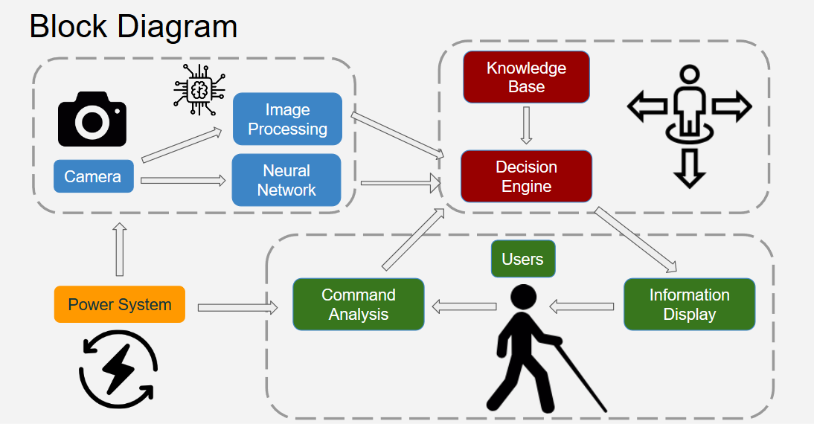
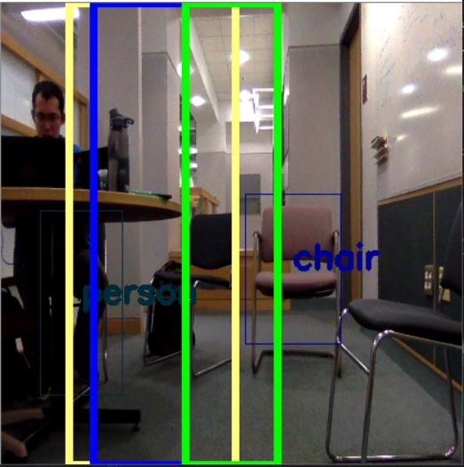
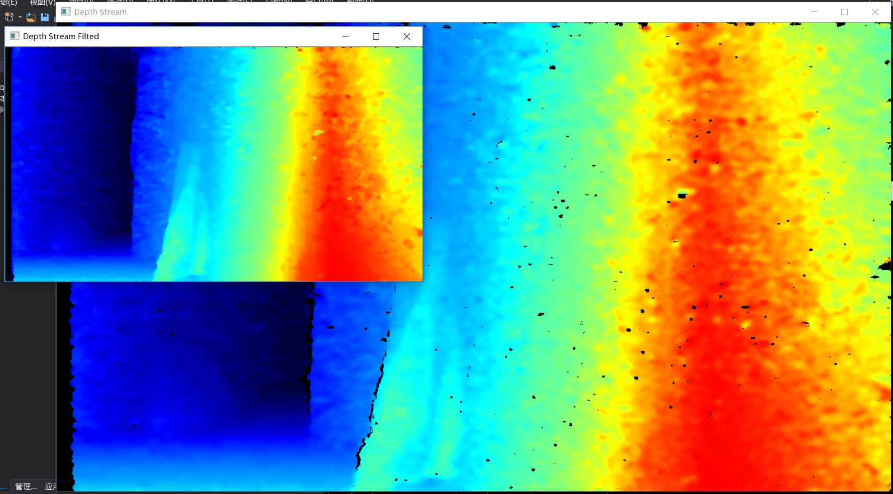

# EC601_Robotic_Guidedog
Repository for EC601 Project: Robotic Guide dog

## Contents

1. Object Detection in RGB color image using neural network
2. ad-hoc decision algorithm to generate directional instruction
3. utilities for processing and storing depth data obtained from Intel RealSense RGB-D camera.
4. Implementation of Djikstra Algorithm for path planning using depth data

## Get Started

### Reference Repos: 
* tinyYOLO implementation taken from simo23:tinyYOLOv2 at https://github.com/simo23/tinyYOLOv2

### Software Dependencies:
1. General setup:
    
    The main part of this repo is build and test on **Windows** 10 with **Anaconda3**. On other platforms such as MAC and Linix, code should also work without significant modification.
2. For testing decision algorithm:

    * OpenCV (Build and test with version 3.4.3)
    * TensorFlow (Using Version 1.10.0)
    * (Optional: CUDA 9.0 for using GPU acceleration)
3. For using the Intel RealSense code:

    * OpenCV
    * librealsense (Intel RealSense camera driver, build and test with python wrapper called pyrealsense2. Only needed when you want to read from .bag file)
4. For using path planning:
   
   * OpenCV (Only used for drawing planning result) 

## How things work and Examples

0. System Block Diagram
   
   Three main modules in our system:
   
   * Image Processing and Object Detection module
   * Decision Module
   * User Interface Module 

    
1. Object Detection and Decision Algorithm
   
    The Object Detection module(TinyYOLO Neural Network) find the obstacles in scene, and pass obstacle information to decision algorithm. The decision algorithm generate resonable instruction based on finding the maximum free space in scene.

   
2. Intel RealSense depth data post-processing

    We are trying to use depth data from Intel RealSense RGB-D camera to imporve the capability of obstacle detection.

    
3. Path Planning
   
   Performing path planning on depth data.

   